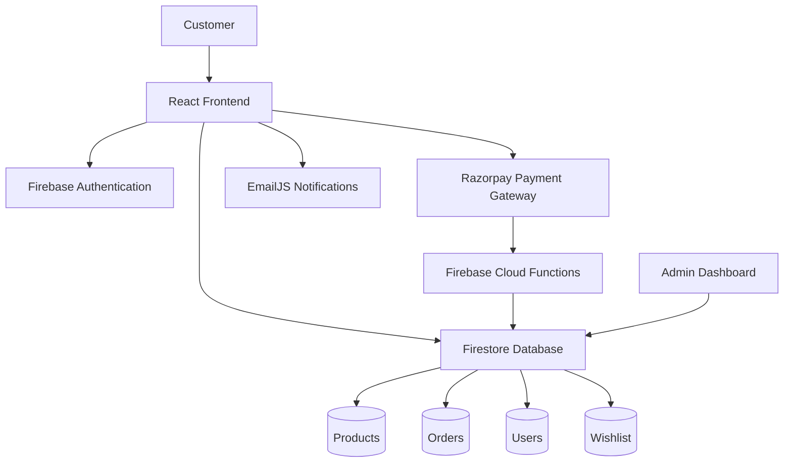
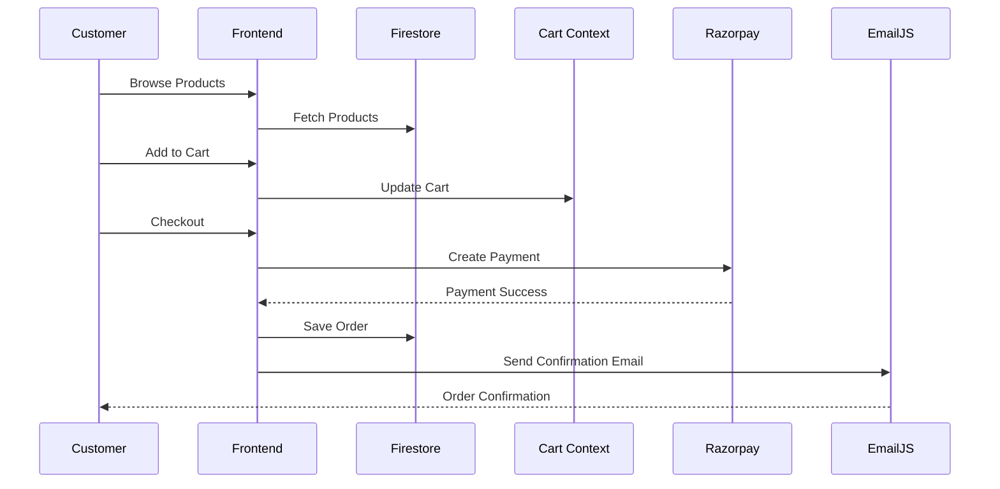
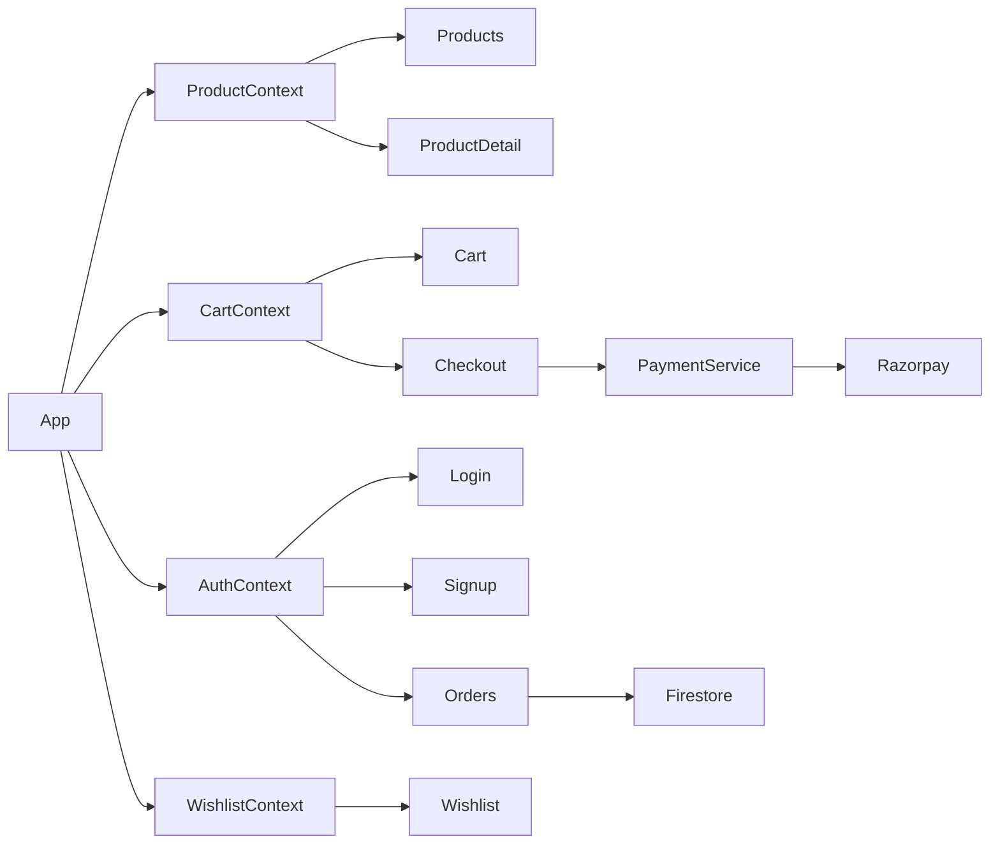
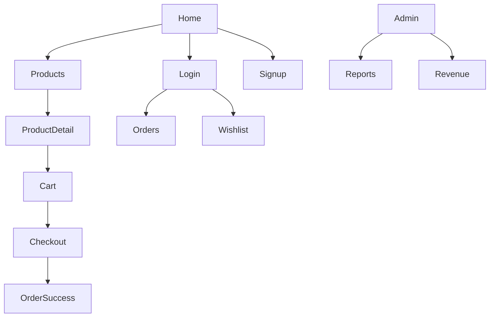

# Panstellia

Luxury jewelry and lifestyle e-commerce platform built with React, Firebase, Razorpay, and EmailJS.

---

## Overview

Panstellia provides a modern shopping experience with:

* Product catalog browsing
* Product detail pages
* Shopping cart management
* Wishlist functionality
* User authentication
* Secure checkout & payment processing
* Order management
* Admin dashboard
* Email notifications
* Firebase backend integration

---

## Tech Stack

| Layer          | Technology              |
| -------------- | ----------------------- |
| Frontend       | React 18                |
| Build Tool     | Vite                    |
| Styling        | Tailwind CSS            |
| Routing        | React Router            |
| Authentication | Firebase Authentication |
| Database       | Firestore               |
| Payments       | Razorpay                |
| Email Service  | EmailJS                 |
| Hosting        | Firebase / Vercel       |
| Animations     | Framer Motion           |

---

# Architecture

## High-Level System Architecture



---

## Application Flow



---

## Module Architecture



---

# Project Structure

```text
Panstellia/
│
├── public/
│
├── src/
│   │
│   ├── assets/
│   │
│   ├── components/
│   │   ├── Layout/
│   │   ├── Navbar/
│   │   ├── Footer/
│   │   └── UI/
│   │
│   ├── context/
│   │   ├── AuthContext.jsx
│   │   ├── CartContext.jsx
│   │   ├── ProductContext.jsx
│   │   └── WishlistContext.jsx
│   │
│   ├── pages/
│   │   ├── Home.jsx
│   │   ├── Products.jsx
│   │   ├── ProductDetail.jsx
│   │   ├── Cart.jsx
│   │   ├── Checkout.jsx
│   │   ├── Wishlist.jsx
│   │   ├── Login.jsx
│   │   ├── Signup.jsx
│   │   ├── Orders.jsx
│   │   ├── OrderDetails.jsx
│   │   ├── OrderSuccess.jsx
│   │   ├── Admin.jsx
│   │   ├── RevenueAdmin.jsx
│   │   └── ReportsAdmin.jsx
│   │
│   ├── services/
│   │   ├── firebase.js
│   │   ├── payment.js
│   │   ├── emailjs.js
│   │   ├── orderNotifications.js
│   │   └── emailTemplates.js
│   │
│   ├── App.jsx
│   └── main.jsx
│
├── functions/
│
├── firebase.json
├── vite.config.js
├── package.json
└── README.md
```

---

# Core Modules

## Authentication Module

### Responsibilities

* User registration
* User login
* User logout
* Session management
* Authentication persistence
* Protected route access

### Files

```text
src/context/AuthContext.jsx
```

---

## Product Module

### Responsibilities

* Product retrieval
* Product listing
* Product details
* Search and filtering
* Inventory access

### Files

```text
src/context/ProductContext.jsx
```

---

## Cart Module

### Responsibilities

* Add products to cart
* Remove products from cart
* Quantity updates
* Cart state persistence
* Checkout preparation

### Files

```text
src/context/CartContext.jsx
```

---

## Wishlist Module

### Responsibilities

* Save favorite products
* Remove favorites
* User-specific wishlist storage

### Files

```text
src/context/WishlistContext.jsx
```

---

## Payment Module

### Responsibilities

* Razorpay integration
* Payment order creation
* Payment verification
* Transaction handling

### Files

```text
src/services/payment.js
functions/
```

---

## Notification Module

### Responsibilities

* Order confirmation emails
* Customer notifications
* Email template generation

### Files

```text
src/services/emailjs.js
src/services/orderNotifications.js
src/services/emailTemplates.js
```

---

## Admin Module

### Features

* Product management
* Order monitoring
* Revenue analytics
* Sales reports
* Customer management

### Files

```text
src/pages/Admin.jsx
src/pages/RevenueAdmin.jsx
src/pages/ReportsAdmin.jsx
```

---

# Routing Flow



---

# Environment Variables

## Frontend

Create a `.env` file:

```env
VITE_FIREBASE_API_KEY=
VITE_FIREBASE_AUTH_DOMAIN=
VITE_FIREBASE_PROJECT_ID=
VITE_FIREBASE_STORAGE_BUCKET=
VITE_FIREBASE_MESSAGING_SENDER_ID=
VITE_FIREBASE_APP_ID=

VITE_EMAILJS_PUBLIC_KEY=
VITE_EMAILJS_SERVICE_ID=
VITE_EMAILJS_TEMPLATE_ID=

VITE_RAZORPAY_KEY_ID=
```

## Firebase Functions

```env
RAZORPAY_KEY_ID=
RAZORPAY_KEY_SECRET=
```

---

# Installation

Clone the repository:

```bash
git clone https://github.com/panstellia-spm/Panstellia.git
```

Navigate into the project:

```bash
cd Panstellia
```

Install dependencies:

```bash
npm install
```

Start development server:

```bash
npm run dev
```

---

# Production Build

```bash
npm run build
```

---

# Firebase Functions Deployment

```bash
cd functions

npm install

firebase deploy --only functions
```

---

# Security

* Firebase Authentication
* Protected Routes
* Admin Access Control
* Firestore Security Rules
* Secure Razorpay Integration
* Environment Variable Protection

---

# Future Enhancements

* Product Reviews & Ratings
* Coupon & Discount Engine
* Shipment Tracking
* Inventory Automation
* Recommendation Engine
* Analytics Dashboard
* Multi-vendor Marketplace Support

---

# License

Copyright © Panstellia.

All rights reserved.
